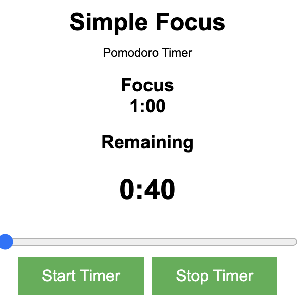

# Simple Focus Mode

This is my take on the **Simple Focus Mode**  Extension which I have created for Chrome.

> I just published Simple Focus Mode: Boost Your Productivity with My Chrome Extension https://link.medium.com/iGcsnNTTezb 

This is a simple Pomodoro Timer extension for Google Chrome called **Simple Focus Mode**. It helps users improve productivity by breaking their work into focused intervals, separated by short breaks. The extension allows users to start a Pomodoro session, pause it, and customize the duration of the session.

## Features

- Start, pause, and reset Pomodoro timer
- Customize the Pomodoro duration in increments of 15 minutes, from 15 minutes to 2 hours
- Displays the remaining time in the popup
- Plays a soft ping sound at the end of the Pomodoro session

## Installation

1. Download or clone the repository.
2. Open Google Chrome and navigate to `chrome://extensions`.
3. Enable "Developer mode" in the top right corner.
4. Click on the "Load unpacked" button and select the downloaded repository folder.
5. The Simple Focus Mode extension should now be installed and visible in your extensions list.

## Usage

1. Click on the Simple Focus Mode icon in the Chrome toolbar.
2. Adjust the duration of the Pomodoro session using the slider, if desired.
3. Click on the "Start Pomodoro" button to start the timer.
4. The remaining time will be displayed in the popup. You can pause the timer by clicking on the "Pause Pomodoro" button.
5. When the timer ends, a soft ping sound will play, and a "Timer Ended" message will appear on the screen.

## Contributing

Feel free to contribute to this project by opening issues or submitting pull requests for improvements or bug fixes.

## License

This project is released under the [MIT License](https://opensource.org/licenses/MIT).
